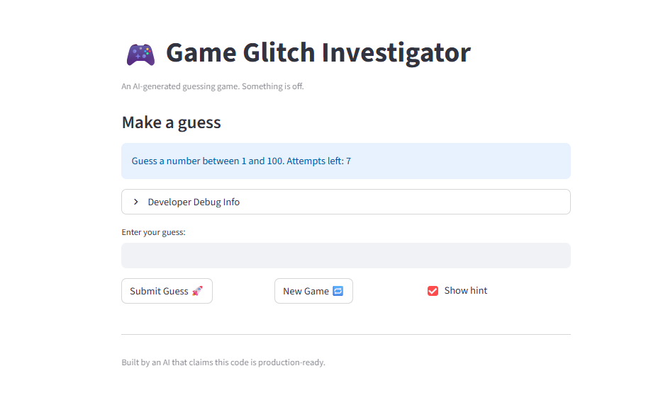

# 🎮 Game Glitch Investigator: The Impossible Guesser

## 🚨 The Situation

You asked an AI to build a simple "Number Guessing Game" using Streamlit.
It wrote the code, ran away, and now the game is unplayable.

- You can't win.
- The hints lie to you.
- The secret number seems to have commitment issues.

## 🛠️ Setup

1. Install dependencies: `pip install -r requirements.txt`
2. Run the broken app: `python -m streamlit run app.py`

## 🕵️‍♂️ Your Mission

1. **Play the game.** Open the "Developer Debug Info" tab in the app to see the secret number. Try to win.
2. **Find the State Bug.** Why does the secret number change every time you click "Submit"? Ask ChatGPT: _"How do I keep a variable from resetting in Streamlit when I click a button?"_
3. **Fix the Logic.** The hints ("Higher/Lower") are wrong. Fix them.
4. **Refactor & Test.** - Move the logic into `logic_utils.py`.
   - Run `pytest` in your terminal.
   - Keep fixing until all tests pass!

## 📝 Document Your Experience

- [x] **Describe the game's purpose.** The game is a number guessing app built with Streamlit where players try to guess a secret number within a difficulty-based range (e.g., 1-20 for Easy, 1-100 for Normal). It provides hints ("Higher" or "Lower"), tracks attempts, and scores based on performance, with options to start new games.
- [x] **Detail which bugs you found.** The hints were inverted (said "Go HIGHER!" for too-high guesses), the input box didn't clear on new games, the "New Game" button didn't reset session state (requiring page refresh), and the secret number sometimes converted to string causing comparison errors.
- [x] **Explain what fixes you applied.** Corrected hint messages and arrows in `check_guess`, added session state management for input clearing, updated "New Game" to reset all state (status, history, score), removed string conversion of secret, refactored functions to `logic_utils.py`, updated tests to match new returns, and added FIXME comments for clarity.

## 📸 Demo

- [x]  

## 🚀 Stretch Features

- [ ] [If you choose to complete Challenge 4, insert a screenshot of your Enhanced Game UI here]
